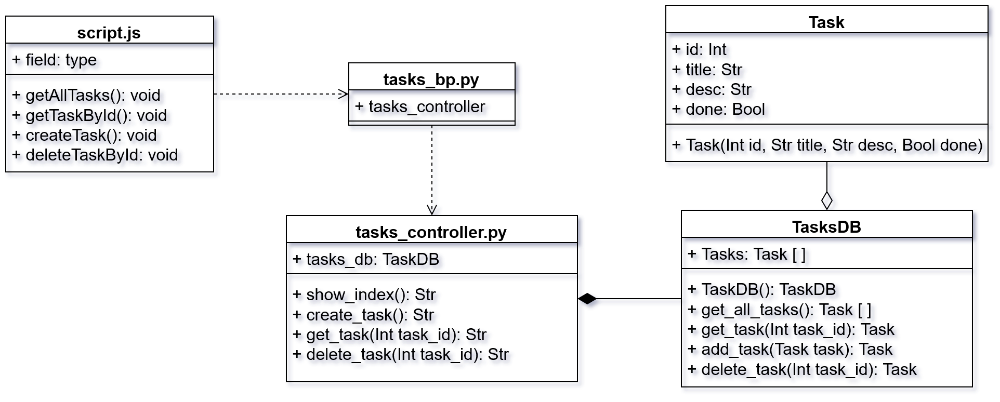

# MVC Design Pattern Demo

## Setup

-   Clone the repo
    ```bash
    git clone https://github.com/estebanbedoyazuluaga/mvc-demo.git
    cd mvc-demo
    ```
-   using `venv` is recommended
    ```bash
    # run this AFTER clonning the repo
    python3 -m venv .venv/ && source .venv/bin/activate
    ```
-   Make sure you have `flask` installed
    ```bash
    pip install flask
    ```

## Running

```bash
flask run  --debug --host '0.0.0.0' --port 7777
```

## UML Diagram

